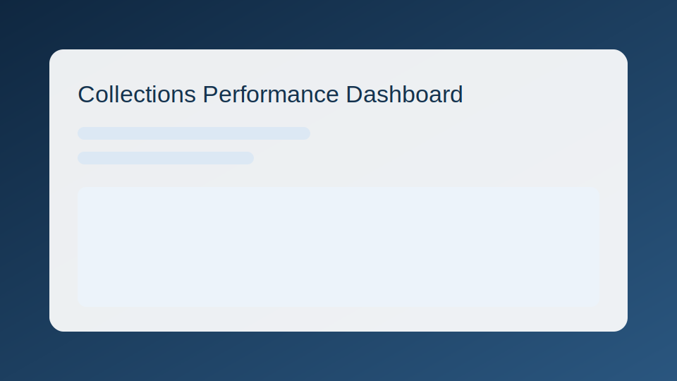
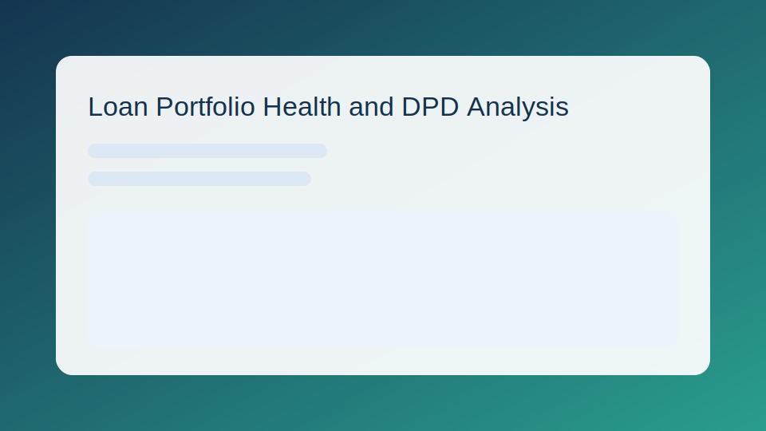
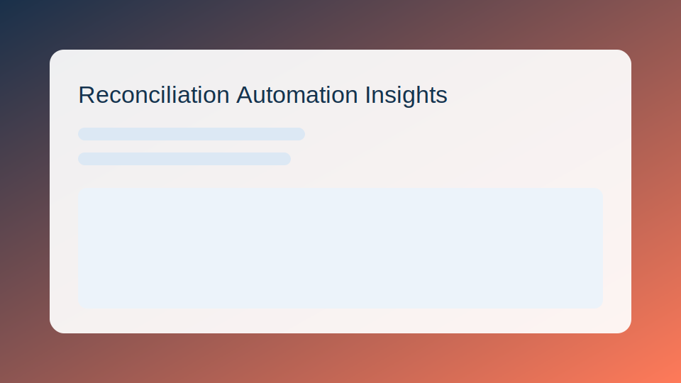
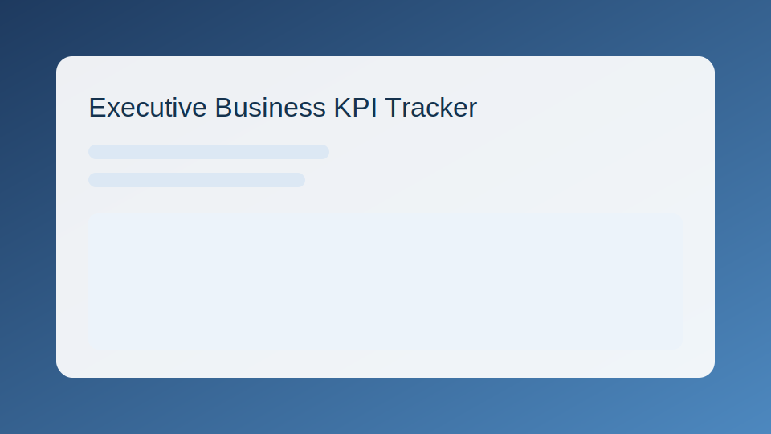

<link rel="preconnect" href="https://fonts.googleapis.com">
<link rel="preconnect" href="https://fonts.gstatic.com" crossorigin>
<link href="https://fonts.googleapis.com/css2?family=Space+Grotesk:wght@400;500;700&family=Manrope:wght@400;600;700&display=swap" rel="stylesheet">

<section class="hero fade-up">
  <h1>Ronak Chawda, CA</h1>
  
Turning raw data into decisions through clear dashboards and business-focused analytics.

  
I solve finance and operations problems by combining domain knowledge with practical analytics, so teams move faster with confidence.

  <a class="cta" href="https://www.linkedin.com/in/ronak-chawda-ca">Connect on LinkedIn</a>
</section>

<h2 class="section-title fade-up delay-1">Technical Skills</h2>
<section class="grid fade-up delay-1">
  <article class="card">
    <h3>Programming</h3>
    Core Tools
    
Python, SQL

  </article>
  <article class="card">
    <h3>Visualization</h3>
    Dashboarding
    
Power BI, Tableau

  </article>
  <article class="card">
    <h3>Business Analytics</h3>
    Decision Support
    
KPI design, reconciliation analytics, financial storytelling

  </article>
</section>

<h2 class="section-title fade-up delay-2">Project Showcases</h2>
<section class="grid fade-up delay-2">
  <article class="card">
    <h3>Collections Performance Dashboard</h3>
    
Tracked recovery trends and risk signals to support faster action by collections teams.

    

      <a href="#">Live Dashboard</a>
      <a href="#">Project Repository</a>
    

    
  </article>
  <article class="card">
    <h3>Loan Portfolio Health and DPD Analysis</h3>
    
Monitored movement across DPD buckets to identify high-risk segments early.

    

      <a href="#">Live Dashboard</a>
      <a href="#">Project Repository</a>
    

    
  </article>
  <article class="card">
    <h3>Reconciliation Automation Insights</h3>
    
Highlighted mismatches and process bottlenecks to reduce manual checks.

    

      <a href="#">Live Dashboard</a>
      <a href="#">Project Repository</a>
    

    
  </article>
  <article class="card">
    <h3>Executive Business KPI Tracker</h3>
    
Built a single performance view for leadership reviews and weekly planning.

    

      <a href="#">Live Dashboard</a>
      <a href="#">Project Repository</a>
    

    
  </article>
</section>

<h2 class="section-title fade-up delay-3">Experience and Education</h2>
<section class="card timeline fade-up delay-3">
  
<strong>Experience:</strong> Chartered Accountant with hands-on delivery of analytics-led reporting and performance improvement initiatives.

  
<strong>Focus:</strong> Finance and operations analytics, reconciliation intelligence, and stakeholder-ready dashboards.

  
<strong>Education:</strong> Chartered Accountant (CA), The Institute of Chartered Accountants of India.

</section>
